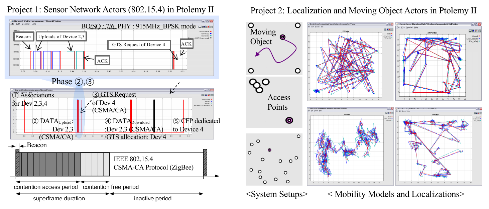
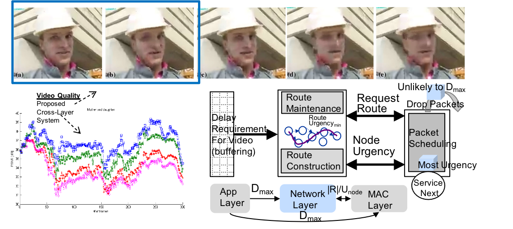

* [Full Paper](){: .btn .btn-purple } **Kijin An** and Eli Tilevich, "Communicating Web Vessels: Improving the Responsiveness of Mobile Web Apps with Adaptive Redistribution," accepted to *21th International Conference on Web Engineering (ICWE 2021)* (**17%, 22/128**). [pdf](../ICWE_2021_paper_Kijin.pdf), [video](https://kjproj84.github.io/ICWE2021_KIJIN_AN.mp4), **Best Paper Award🏆**
* [Full Paper](){: .btn .btn-purple } **Kijin An** and Eli Tilevich, "Client Insourcing: Bringing Ops In-House for Seamless Re-engineering of Full-Stack JavaScript Applications," *Proceedings of the Web Conference 2020 (WWW 2020)*, 179-189, April 2020 (**19%, 217/1129**). [pdf](https://people.cs.vt.edu/~tilevich/papers/Client_Insourcing_WebConf2020.pdf), [video](https://youtu.be/69U5Y6HsAOw), [code](https://github.com/kjproj84/JS-RCI)
* **Kijin An**, "Enhancing Web App Execution with Automated Reengineering," *Companion Proceedings of the Web Conference 2020 (PhD Symposium in WWW 2020)*, 274-278, April 2020. [video](https://youtu.be/EvnTicEUkzU)
* [Full Paper](){: .btn .btn-purple } **Kijin An** and Eli Tilevich, "D-Goldilocks: Automatic Redistribution of Remote Functionalities for Performance and Efficiency," *Proceedings of the 27th IEEE International Conference on Software Analysis, Evolution and Reengineering (SANER 2020)*, 251-260, February 2020 (**21%, 42/199**). [pdf](https://people.cs.vt.edu/~tilevich/papers/SANER2020.pdf), [slides](../SANER20_D_Goldilocks.pdf) 
* [Journal](){:.btn} Yin Liu, **Kijin An**, and Eli Tilevich,  "RT-Trust: Automated Refactoring for Different Trusted Execution Environments under Real-Time Constraints," *Journal of Computer Languages (COLA)*, Volume 56, 100939, 2020. [pdf](https://people.cs.vt.edu/~tilevich/papers/RT_Trust_for_Journal.pdf), **Nominated for the Best Paper Award** 
* [Full Paper](){: .btn .btn-purple } **Kijin An** and Eli Tilevich. “Catch & Release: An Approach to Debugging Distributed Full-Stack JavaScript Applications“, *19th International Conference on Web Engineering (ICWE 2019)*, 459-473, June 2019 (**25%, 26/106**). [pdf](https://people.cs.vt.edu/~tilevich/papers/ICWE2019_debugging_insourcing.pdf), [slides](http://web.geni-pco.com/icwe2019/2Catch_Release_An_Approach_to_Debugging_Distributed_Full-Stack_JavaScript_Applications.pdf)
* **Kijin An**, "Facilitating the Evolutionary Modifications in Distributed Apps via Automated Refactoring," *19th International Conference on Web Engineering (PhD Symposium in ICWE 2019)*, 548-553, June 2019. [slides](http://web.geni-pco.com/icwe2019/3Facilitating_the_Evolutionary_Modifications_in_Distributed_Apps_via_Automated_Refactoring.pdf)
* [Full Paper](){: .btn .btn-purple } Yin Liu, **Kijin An**, and Eli Tilevich, "RT-Trust: Automated Refactoring for Trusted Execution Under Real-Time Constraints," *Proceedings of the 17th International Conference on Generative Programming: Concepts & Experience (GPCE 2018)*, 175-187, Nov 2018. [pdf](https://people.cs.vt.edu/~tilevich/papers/cpi-gpce.pdf) (Yin made [slides](https://drive.google.com/file/d/1Ucm3oZg4VfYglxhbplEIFLWWB35yWy80/view) and [poster](https://drive.google.com/file/d/1RO3zCYDZHClDxdlkMyO9zhIsmMEar1sa/view))
* [Full Paper](){: .btn .btn-purple } **Kijin An**, Na Meng, and Eli Tilevich, "Automatic Inference of Java-to-Swift Translation Rules for Porting Mobile Applications,” *MobileSoft 2018*, 180-190, May 2018. [pdf](https://people.cs.vt.edu/~tilevich/papers/inference-translation-mobilesoft2018.pdf), [**Nominated for the Best Paper Award**](https://www.icse2018.org/details/mobilesoft-2018-papers/6/Automatic-Inference-of-Java-to-Swift-Translation-Rules-for-Porting-Mobile-Application)

<h3>Robotics Research in KIST</h3>
* **Kijin An**, Geunjae Lee, Sang-Seok Yun, and JongSuk Choi, "Multiple Humans Recognition of Robot Aided by Perception Sensor Network," *In. Proc. Int. Conf. Ubiquitous Robots and Ambient Intelligence (URAI)*, pp. 359-361, Oct. 2015. [poster](../poster/URAI15_POSTER_SENSOR_NET_1025.pdf)
* Geunjae Lee, **Kijin An**, Sang-Seok Yun, and JongSuk Choi, "A Simultaneous Robot Service Scheme for Multi-Users," *In. Proc. Int. Conf. Ubiquitous Robots and Ambient Intelligence (URAI)*, pp. 373-374, Oct. 2015. [poster](../poster/URAI15_POSTER_SCHEDULING_1025.pdf)
* Anh Vu Le, **Kijin An** and JongSuk Choi, “Multiple human tracking on robot operation system,” *In. Proc. Int. Conf. Ubiquitous Robots and Ambient Intelligence (URAI)*, Oct. 2015.
* **Kijin An**, Hyeon-woo Park and JongSuk Choi, “Reliable Fusion method of multiple Human information over a Heterogeneous Sensor Network,” *IEEE RO-MAN 2015*.
* Anh Vu Le, **Kijin An** and JongSuk Choi, “Group-based multiple people tracking in perception sensor network,” *IEEE RO-MAN* 2015.
* JiGwan Park, **Kijin An**, and JongSuk Choi, "Low-Body-Part Detection using RGB-D camera." *Proceedings of the Tenth Annual ACM/IEEE International Conference on Human-Robot Interaction* Extended Abstracts. ACM, 2015. 
* [Full Paper](){: .btn .btn-purple } **Kijin An**, JiGwan Park, Minh Do Hoang and JongSuk Choi, “Dispensing Materials of mobile Robot cooperating with Perception Sensor Network,” *URAI 2014*. [poster](../poster/URAI14_POSTER_Kijin.pdf) 
* JiGwan Park, **Kijin An**, Daijin Kim and JongSuk Choi, “Multiple Human Tracking using Multiple Kinects for an Attendance Check System of a Smart Class,” *URAI 2013*.
* [Full Paper](){: .btn .btn-purple } JiGwan Park, **Kijin An**, and JongSuk Choi, "Realistic 3D simulation of multiple human recognition over Perception Sensor Network," Robot and Human Interactive Communication, *IEEE RO-MAN 2014*. [poster](../poster/ro-man2014_poster.pdf)
* [Full Paper](){: .btn .btn-purple } **Kijin An**, JongSuk Choi, “A 3D Simulation Approach for Multi-human Detection using a Multi-sensor frame,” *IEEE RO- MAN* 2013. 
<table>
<tr>
<td width="50%">
<iframe width="432" height="243" src="https://www.youtube.com/embed/Fg4fI0PD0ns" title="YouTube video player" frameborder="0" allow="accelerometer; autoplay; clipboard-write; encrypted-media; gyroscope; picture-in-picture" allowfullscreen></iframe>
</td>
<td width="50%">
<iframe width="432" height="243" src="https://www.youtube.com/embed/DNClrSYuss8" title="YouTube video player" frameborder="0" allow="accelerometer; autoplay; clipboard-write; encrypted-media; gyroscope; picture-in-picture" allowfullscreen></iframe>
</td>
</tr>
</table>

<h3>Multimedia Networking Lab in POSTECH</h3>
* [Full Paper](){: .btn .btn-purple } Wan Kim, Hyunchul Joo, **Kijin An**, and Hwangjun Song, "A novel packet urgency metric-based cross-layer design for video streaming over multi-rate MANETs," *International Wireless Communication and Mobile Computing (IWCMC)*, 2013.
* [Journal](){:.btn} Wan Kim, Hyunchul Joo, **Kijin An**, Inkyu Lee, and Hwangjun Song, "Urgency-based scheduling and routing algorithms for delay-sensitive data transmission over mobile ad hoc networks,” *ACM/Springer Wireless Networks*, Vol. 19, No. 7, pp. 1595-1609, 2013. (Master thesis)
* [Full Paper](){: .btn .btn-purple } Hyunchul Joo, **Kijin An**, and Hwangjun Song, "Urgency-based Packet Scheduling and Routing Algorithms for Video Transmission over MANETs," *IET International Communication Conference on Wireless Mobile (CCWMC)* 2011.
* [Domestic Journal](){:.btn} W. Kim, **Kijin An**, H. Joo, G. Lee, J. An, M. Sohn, Y. Mo Yang and H. Song, "Indoor Location Recognition Simulator over UWB Channel," *Journal of KICS*, Vol.35 No. 7, pp. 1058-1065, 2010.
* [Domestic Journal](){:.btn} **Kijin An**, H. Joo, H. Song, “Cross-layer based Transmission Scheme for Multimedia Service over Mobile Ad Hoc Network,” *The Journal of Korean Institute of Communications and Information Sciences*, Vol. 34, No.11, pp. 1216-1224, 2009.
* [Full Paper](){: .btn .btn-purple } **Kijin An** and Hwangjun Song, "An effective cross-layer packet scheduling and routing algorithm for delay-sensitive media transmission over MANET," *IEEE International Conference on Communications (ICC)* 2009. (**34.9%, 1046/3000**) 	
* [Domestic Journal](){:.btn} **Kijin An**, H. Joo, H.R. Oh, Y.D. Kim, Y.M. Yang, H. Song," Design and Implementation of Sensor Network Actors Supporting Ptolemy Tool," *Journal of the Korea society for simulation*, Vol. 17, No. 4, pp.1-10, 2008.

