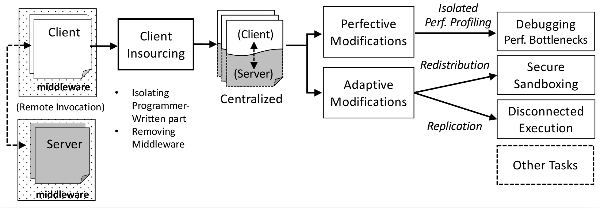

Actively used software applications must be changed continuously to ensure their utility, correctness, performance, safety, etc. To perform these changes, programmers spend a considerable amount of time and effort pinpointing the exact locations in the code to modify, a particularly hard task for distributed applications. In such applications, server/middleware misconfigurations and network volatility often cause performance and correctness problems. My dissertation research puts forward a novel approach to facilitating the evolutionary modifications of distributed applications via automatic, domain-specific, architectural refactorings. By flexibly changing the application architecture, with different functionalities becoming local or remote at will, programmers can more easily perform various kinds of perfective and adaptive modifications, including performance profiling, safety adaptations, and fault-handling. In the age of pervasive distribution, the deliverables of this research can become helpful tools in the toolset of programmers that face the challenges of maintaining and evolving modern computing applications.

